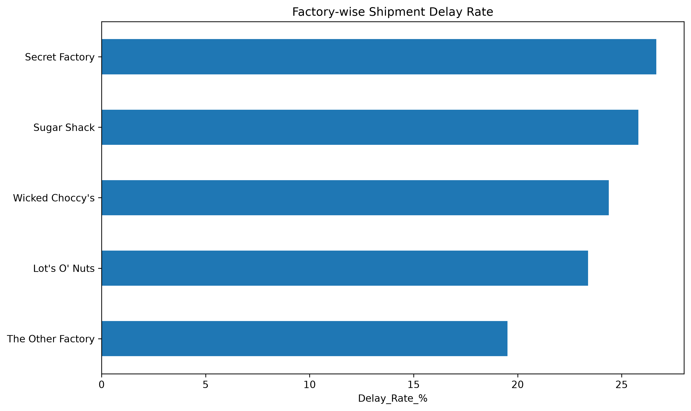
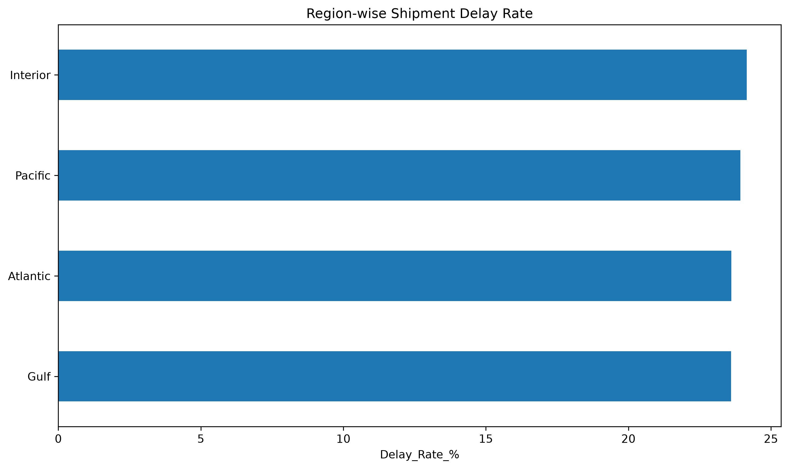
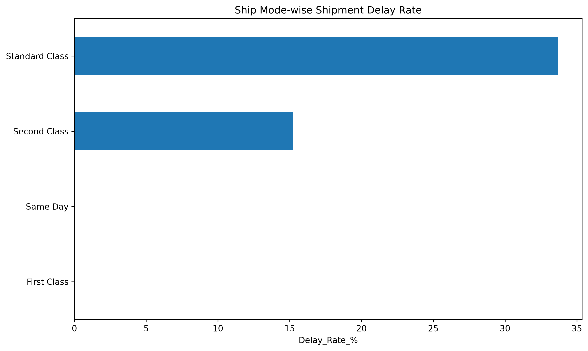
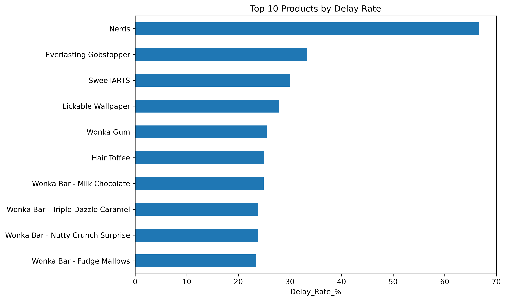
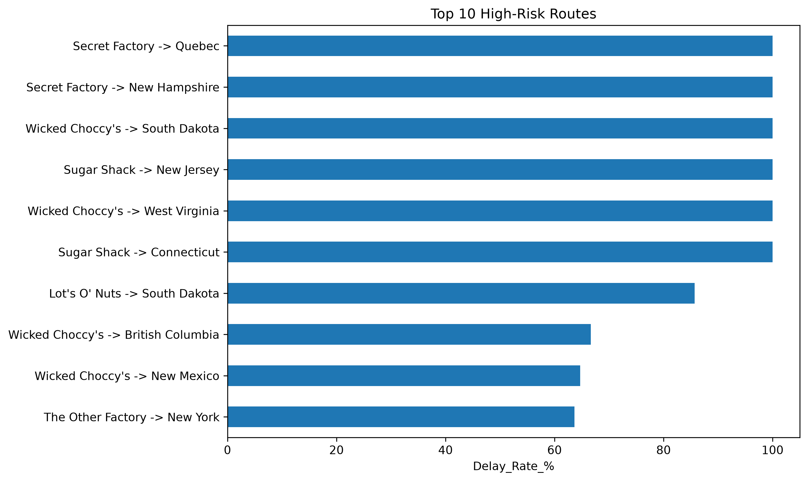

## 🚀 Live Dashboard

[👉 View Live Dashboard](https://yashika-logistics-dashboard.streamlit.app/)

---
# 🍫 Nassau Candy Route Efficiency Analysis

## 📌 Project Overview

Nassau Candy Route Efficiency Analysis is a data analytics project focused on evaluating shipment and logistics performance for Nassau Candy Distributor.

The project analyzes shipment records across factories, routes, regions, states, products, and shipping modes to identify operational bottlenecks, delay patterns, and high-risk routes.

The analysis combines Python-based data processing with statistical analysis and visualizations to generate actionable logistics insights.

---

## 🎯 Business Problem

Shipment delays can affect customer satisfaction, operational efficiency, and business performance.

The objective of this project is to answer key business questions such as:

- Which factories have the highest shipment delay rates?
- Which regions experience more delays?
- Which shipping modes have the highest delay rates?
- Which products are most affected by delays?
- Which routes are high-risk?
- Does shipment volume have a relationship with lead time?
- Where should logistics teams prioritize operational improvements?

---

## 📊 Dataset Overview

The dataset contains **10,194 shipment records** and **18 original columns**.

The analysis created additional calculated fields for lead-time, factory, route, and delay analysis.

### Key Dataset Statistics

| Metric | Value |
|---|---:|
| Total Records | 10,194 |
| Valid Records | 9,009 |
| Invalid Lead-Time Records | 1,185 |
| Delayed Shipments | 2,147 |
| Overall Delay Rate | 23.83% |
| Average Lead Time | 466.28 days |
| Median Lead Time | 365 days |
| Total Sales | 141,783.63 |
| Total Gross Profit | 93,442.80 |
| Total Units | 38,654 |
| Factories | 5 |
| Routes | 196 |
| States | 59 |

---

## 🔍 Analysis Performed

### 1. Data Validation

The dataset was checked for:

- Missing values
- Invalid lead-time values
- Invalid sales values
- Invalid cost values
- Invalid unit values

Records with negative lead times were excluded from the valid shipment analysis.

---

### 2. Lead-Time Analysis

Shipment lead time was calculated using the difference between the adjusted ship date and order date.

Key statistics:

- Average Lead Time: **466.28 days**
- Median Lead Time: **365 days**
- Minimum valid Lead Time: **0 days**
- Maximum valid Lead Time: **733 days**

A delay threshold of **729 days** was used for delay classification.

---

### 3. Factory Analysis

Factory-level shipment performance was analyzed using:

- Shipment volume
- Delayed shipments
- Delay rate
- Average lead time
- Sales
- Gross profit

**Secret Factory** recorded the highest factory-level delay rate at **26.67%**.

**The Other Factory** recorded the lowest delay rate at **19.51%**.

---

### 4. Region Analysis

Shipment performance was analyzed across four regions:

- Atlantic
- Gulf
- Interior
- Pacific

The **Interior region** recorded the highest delay rate at **24.15%**.

---

### 5. Shipping Mode Analysis

Shipping performance was evaluated across:

- Standard Class
- Second Class
- First Class
- Same Day

**Standard Class** recorded the highest delay rate at **33.68%**.

Same Day and First Class recorded zero delayed shipments in the analyzed valid dataset.

---

### 6. Product Analysis

Product-level delay performance was analyzed using shipment volume and delay rate.

Key observations include:

- **Nerds** recorded the highest delay rate among the analyzed products at approximately **66.67%**.
- **Everlasting Gobstopper** recorded approximately **33.33%**.
- **SweeTARTS** recorded approximately **30.00%**.
- **Lickable Wallpaper** recorded approximately **27.85%**.

High-volume products such as Wonka Bar - Milk Chocolate were also evaluated because delays affecting large shipment volumes can have greater operational impact.

---

### 7. Route Analysis

Routes were defined as:

**Factory → Customer State**

A total of **196 routes** were analyzed.

Route KPIs included:

- Shipment volume
- Average lead time
- Median lead time
- Lead-time standard deviation
- Minimum lead time
- Maximum lead time
- Lead-time range

High-risk routes were identified using delay rate.

Because some routes have very low shipment volumes, delay rates for such routes should be interpreted together with shipment volume.

---

### 8. Correlation Analysis

The correlation between route shipment volume and average lead time was approximately:

**-0.001**

This indicates an almost negligible linear relationship between shipment volume and average lead time.

Therefore, shipment volume alone does not appear to explain differences in route lead time.

---

## 📈 Visualizations

The project generates the following visualizations:

### Factory-wise Delay Rate



### Region-wise Delay Rate



### Ship Mode-wise Delay Rate



### Top Products by Delay Rate



### Top High-Risk Routes



---

## 💡 Key Business Insights

### 🚚 Shipping Mode

Standard Class has the highest delay rate at **33.68%**, making it an important area for service-level improvement.

### 🏭 Factory Performance

Secret Factory has the highest factory-level delay rate at **26.67%**.

### 🌎 Regional Performance

Interior has the highest regional delay rate at **24.15%**, although differences between regions are relatively small.

### 🛣️ Route Risk

Several routes have high delay rates. However, low-volume routes should not automatically be considered consistently poor-performing routes.

### 📦 Product Performance

Product delay rates vary considerably. High-volume products should receive particular attention because delays can affect a larger number of shipments.

---

## 🎯 Recommendations

Based on the analysis:

1. Investigate high-risk routes while considering both delay rate and shipment volume.
2. Review Standard Class shipment processes.
3. Monitor high-volume products with significant delayed shipments.
4. Investigate operational differences between factories.
5. Analyze transportation and fulfillment processes for routes with unusually high lead times.
6. Monitor route-level KPIs continuously.
7. Use an interactive dashboard to track shipment performance and logistics KPIs.

---

## 🛠️ Technologies Used

- **Python**
- **Pandas**
- **NumPy**
- **Matplotlib**
- **Jupyter Notebook**
- **Streamlit**
- **Git & GitHub**

---

## 📁 Project Structure

```text
Nassau_Candy_Route_Efficiency_Analysis/
│
├── dataset/
│   └── Nassau Candy Distributor.csv
│
├── notebooks/
│   └── Nassau_Candy_Route_Analysis.ipynb
│
├── src/
│   └── data_analysis.py
│
├── outputs/
│   ├── factory_delay_rate.png
│   ├── region_delay_rate.png
│   ├── ship_mode_delay_rate.png
│   ├── top_products_delay_rate.png
│   └── top_high_risk_routes.png
│
├── dashboard/
│
├── README.md
├── requirements.txt
└── .gitignore
<<<<<<< HEAD
=======

---

## 📊 Visualizations

### Factory-wise Shipment Delay Rate


### Region-wise Shipment Delay Rate


### Ship Mode-wise Shipment Delay Rate


### Top 10 High-Risk Routes


### Top 10 Products by Delay Rate


---
>>>>>>> 9594d90 (Add visualization previews to README)
